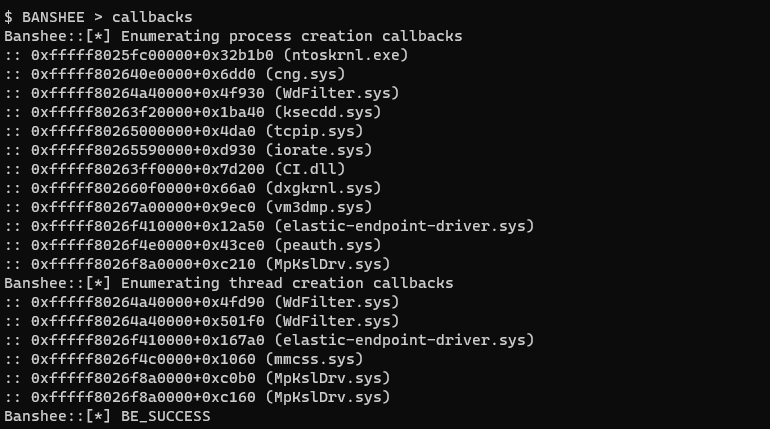

# Banshee

<p align="center">

</p>

Learning about Windows rootkits lately, so here is my own implementation of some techniques. For an overview, see **Features** below.

I am just learning about kernel driver development, so this is for educational purposes mainly.

## What is a Rootkit?

http://phrack.org/issues/55/5.html

## Usage

You can integrate Banshee into your tooling, by including the `Banshee.hpp` file in your project, e.g.:

```c++
Banshee banshee = Banshee();
banshee.Install(driverPath);
banshee.Initialize();

int targetPid = GetDefenderPID();    // this would be your implementation
banshee.IoCtlKillProcess(targetPid); // instruct banshee to kill the targetprocess
```

An example implementation of all the features in a command line client is found in [./BansheeClient/BansheeClient.cpp](./BansheeClient/BansheeClient.cpp).

#### BOF loading and Havoc Plugin

A beacon object file (BOF) for loading the driver is supplied in `auxiliary/LoadDriverBOF` as well as a Plugin for [https://github.com/HavocFramework/Havoc](Havoc) to deploy Banshee to a Demon's host.

## Features

*Get in everyone, we're going to Kernel Land!*

#### Kill processes

`ZwTerminateProcess` is simply called from kernel land to terminate any process. Additionally, you can bury a process to avoid it to restart by setting a kernel callback to process creation: If the target process is created, Banshee will set the `CreationStatus` of the target process to `STATUS_ACCESS_DENIED`.

E.g. to block defender, run `bury` with `msmpeng`, then `kill <defender pid>` and it won't come back anymore, since all process creation events with `msmpeng` in the image full path will be blocked.

#### Change protection levels

This is done by modifying the `EPROCESS` structure, which is an kernel object that describes a processes attributes. It also holds a value that specifies the protection level of the process. 

We can directly modify this value (aka Direct Kernel Object Modification or DKOM), since we are operating in Ring 0.

#### Elevate any process token to SYSTEM

`EPROCESS` also holds a pointer to the current access token, so we can just make it point to e.g. the token of process 4 (`SYSTEM`) to elevate any process to `SYSTEM`.

#### Enumerating kernel callbacks

For now, only Process- and Thread-Creation kernel callbacks are enumerated, by parsing the `PsSetCreateNotifyProcess/ThreadRoutine` routine to reach the private `Psp*` routine and then parsing the address of the array, where kernel callbacks are stored.



#### Protecting the driver file 

By hooking the NTFS filesystem's `IRP_MJ_CREATE` handler, we can block any process from opening a handle to our driver file (This will probably change to a filter driver concept soon).

## Patchguard triggering features

These should only be used with a patchguard bypass or in a lab environment as they trigger BSOD.

#### Hide Process by PID

Again, `EPROCESS` comes to help here - it contains a `LIST_ENTRY` of a doubly linked list called `ActiveProcessLink` which is queried by Windows to enumerate running processes. If we simply unlink an entry here, we can hide our process from tools like Process Monitor or Task Manager.

* This can cause Bluescreens, e.g. when the process is closed while being hidden or due to patchguard scanning the kernel memory.

## Testing & debugging the driver

You need to enable testsigning to load the driver. I also recommend to enable debugging for the kernel.

Run the following from an administrative prompt and reboot afterwards:

```cmd
bcdedit /set testsigning on
bcdedit /debug on
```

Afterwards you can run the client, after compiling the solution, with e.g.:

```cmd
.\x64\Debug\BansheeClient.exe C:\Users\eversinc33\source\repos\Banshee\x64\Debug\Banshee.sys
```

Run this in a VM and create a snapshot. You will probably Bluescreen a lot when developing and can corrupt your system. Be warned.

## TODO 

* Shellcode injection from kernel land
* ETW provider disabling à la https://securityintelligence.com/posts/direct-kernel-object-manipulation-attacks-etw-providers/
* Registry key protection
* MSR hooking à la https://www.cyberark.com/resources/threat-research-blog/fantastic-rootkits-and-where-to-find-them-part-1
* GPU shenanigans
* Communication over direct TCP to bypass `netstat` and others
* Hiding only on special ocassion, e.g. on opening of task manager, to avoid patchguard crashes
* Backdoor authentication as described in the phrack article linked above
* enumerating more kernel callbacks
* remove threads from PspCidTable: https://www.unknowncheats.me/forum/anti-cheat-bypass/455676-remove-systemthread-pspcidtable.html

## Credits

* Some offset code from and feature inspiration (please check out, great project): https://github.com/Idov31/Nidhogg
* Great introduction to drivers: https://www.codeproject.com/articles/9504/driver-development-part-1-introduction-to-drivers
* Great overview of techniques: https://www.cyberark.com/resources/threat-research-blog/fantastic-rootkits-and-where-to-find-them-part-1
* WinDbg and the Windows Internals book for helping me (kinda) understand what I am doing here lol
* Windows Kernel Programming by Pavel Yosifovich. Great book that I should have read before starting this
